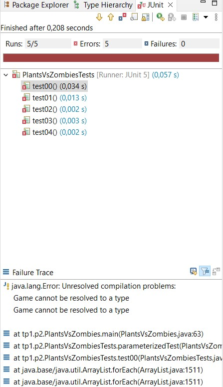
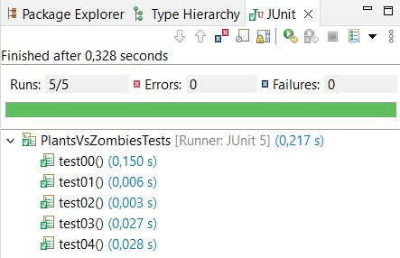

<!-- TOC start -->
- [Práctica 2 (Parte I): Plantas contra zombis Refactored](#práctica-2-parte-i-plantas-contra-zombis-refactored)
  * [Introducción](#introducción)
  * [Refactorización de la solución de la práctica anterior](#refactorización-de-la-solución-de-la-práctica-anterior)
    + [Patrón Command](#patrón-command)
    + [Comando Reset](#comando-reset)
    + [La clase Game y sus diferentes usos](#la-clase-game-y-sus-diferentes-usos)
    + [Herencia y polimorfismo](#herencia-y-polimorfismo)
    + [`GameObjectContainer`](#gameobjectcontainer)
    + [Patrón Factory](#patrón-factory)
      - [Implementación](#implementación)
    + [GameItem y callbacks](#gameitem-y-callbacks)
  * [Pruebas](#pruebas)
<!-- TOC end -->
<!-- TOC --><a name="práctica-2-parte-i-plantas-contra-zombis-refactored"></a>
# Práctica 2 (Parte I): Plantas contra zombis Refactored

**Entrega: Semana del 7 de noviembre**
 
**Objetivo:** Herencia, polimorfismo, clases abstractas e interfaces.

**Preguntas Frecuentes**: Como es habitual que tengáis dudas (es normal) las iremos recopilando en este [documento de preguntas frecuentes](../faq.md). Para saber los últimos cambios que se han introducido [puedes consultar la historia del documento](https://github.com/informaticaucm-TPI/202223-PlantsVsZombies/commits/main/enunciados/faq.md).

<!-- TOC --><a name="introducción"></a>
## Introducción

Esta práctica consiste, fundamentalmente, en aplicar los mecanismos que ofrece la POO para mejorar el código desarrollado hasta ahora en la Práctica 1. En particular, en esta práctica incluiremos las siguientes mejoras:

- En la *Parte I* de la Práctica 2 refactorizamos[^1] el código de la [Práctica 1](../practica1/practica1.md). Así lo preparamos para la *Parte II*. Para ello, modificaremos parte del controlador, distribuyendo su funcionalidad entre un conjunto de clases, mejor estructuradas, para facilitar las extensiones posteriores.
  
- El objetivo es que, al finalizar la refactorización, la práctica pase los mismos tests que los que se pasaron en la Práctica 1.

- Vamos a hacer uso de la herencia para reorganizar los objetos del juego. Hemos visto que hay mucho código repetido en los distintos tipos de objetos. Por ello, vamos a crear una jerarquía de clases que nos permita extender fácilmente la funcionalidad del juego.
    
- En la Parte II, una vez refactorizada la práctica, añadiremos nuevos objetos al juego y nuevos comandos de una forma segura, ordenada y fiable, gracias a la nueva estructura del código.

- La herencia también nos va a permitir redefinir cómo almacenamos la información del estado del juego. En la práctica anterior, al no usar herencia, debíamos tener una lista para cada conjunto de objetos. Sin embargo, en esta versión de la práctica, podremos usar una sola estructura de datos para todos los objetos de juego.   

[^1]: Refactorizar consiste en cambiar la estructura del código (se supone que para mejorarlo) sin cambiar su funcionalidad.

Todos los cambios comentados anteriormente se llevarán a cabo de forma progresiva. El objetivo principal es extender la práctica de una manera robusta, preservando la funcionalidad en cada paso que hagamos y modificando el mínimo código para ampliarla.

<!-- TOC --><a name="refactorización-de-la-solución-de-la-práctica-anterior"></a>
## Refactorización de la solución de la práctica anterior

<!-- TOC --><a name="patrón-command"></a>
### Patrón Command

En la práctica anterior, el usuario podía hacer varias acciones: añadir una planta, listar las plantas disponibles, pedir ayuda, etc. El objetivo técnico de esta *Parte I* es poder añadir nuevas acciones sin tener que modificar código ajeno a la nueva acción. Para ello, vamos a ver el patrón de diseño Command[^2], que es perfecto para este tipo de estructuras.

La idea general es encapsular cada acción del usuario en su propia clase. Cada acción será un comando, de tal manera que el comportamiento de un comando está completamente aislado del resto. 

[^2]: Lo que vamos a ver en esta sección no es el patrón *Command* de manera rigurosa, sino una adaptación que hemos hecho a las necesidades de la práctica.

En el patrón Command van a intervenir las siguientes entidades, que explicaremos en varios pasos según profundicemos en los detalles:

- La clase `Command`. Es una clase abstracta que encapsula la funcionalidad común de todos los comandos concretos.
- Comandos concretos. Son las acciones del usuario: `AddPlantCommand`,`HelpCommand`, `ExitCommand`... Cada acción va a tener su propia clase. Cada comando tiene dos métodos básicos:
    - `matchCommand(String)`: es el método que comprueba si una acción introducida por teclado corresponde a la del comando.
    - `create(String[])`: es el método que crea una instancia del comando dados los parámetros proporcionados por el usuario.
    - `execute(GameWorld)`: ejecuta la acción del comando, modificando el juego. Por qué aparece `GameWorld` y no directamente `Game` se explicará más adelante.

- La clase `Controller`. El controlador en este caso va a ser muy reducido; como veremos más abajo, su funcionalidad va a ser delegada en los comandos concretos.

En la práctica anterior, para saber qué comando se ejecutaba, el **bucle de Juego** implementado mediante el método `run()` del controlador contenía un switch (o una serie de if's anidados) cuyas opciones correspondían a los diferentes comandos.

En la nueva versión, el método `run()` del controlador va a tener, más o menos, este aspecto. Tu código no tiene que ser exactamente igual, pero lo importante es que veas que se asemeja a esta propuesta.

```java
while (!game.isFinished() && !game.isPlayerQuits()) {

    // 1. Draw
    if (refreshDisplay) {
        printGame();
    }

    // 2. User action
    String[] words = prompt();

    if (words.length == 0) {
        System.out.println(error(Messages.UNKNOWN_COMMAND));
    } else {
        Command command = Command.parse(words);
        if (command != null) {
            // 3-4. Game Action & Update
            refreshDisplay = game.execute(command);
        } else {
            refreshDisplay = false;
        }
    }
}
```

En el bucle, mientras el juego no termine, leemos una acción de la consola, la parseamos para obtener el comando correspondiente, ejecutamos el comando y, si la ejecución es satisfactoria y ha cambiado el estado del juego, lo repintamos. En otro caso, si el comando no es válido, mostramos un error.

En el bucle mostrado, la parte más importante es esta línea:
```java
Command command = Command.parse(words);
```

El punto clave es que el controlador sólo maneja comandos abstractos, por lo que no sabe qué comando concreto se ejecuta y qué es lo que hace exactamente el comando. Este es el mecanismo que nos permite añadir fácilmente nuevos comandos concretos.

**El método `parse(String[])`** es un método estático de la clase `Command`, encargado de encontrar qué comando concreto corresponde a la entrada del usuario. Para ello la clase `Command`mantiene una lista `AVAILABLE_COMMANDS` con los comandos disponibles. Este método recorre la lista de comandos para determinar, llamando al método `matchCommand(String)` de cada comando, para averiguar a cuál corresponde la entrada del usuario. Cuando lo encuentra, procesa los parámetros (si los tiene), crea una instancia de ese mismo tipo de comando y lo devuelve al controlador. 

El esqueleto del código es este:
```java
public abstract class Command {

    private static final List<Command> AVAILABLE_COMMANDS = Arrays.asList(
        new AddPlantCommand(),
        new ListPlantsCommand(),
        new ResetCommand(),
        new HelpCommand(),
        // ...
    );


    public static Command parse(String[] commandWords) {
        //... 
    }

    //...
}
```

El `Controller`, después de recibir un `Command`, simplemente le pedirá a `Game` que ejecute el comando.

Todos los comandos tienen una serie de **detalles**: nombre, atajo, detalle, etc. Por ejemplo el comando concreto `HelpCommand:

```java
public class HelpCommand extends Command {

	protected String getName() {
		return Messages.COMMAND_HELP_NAME;
	}

	protected String getShortcut() {
		return Messages.COMMAND_HELP_SHORTCUT;
	}

	public String getDetails() {
		return Messages.COMMAND_HELP_DETAILS;
	}

    // ...
}
```

Como puede apreciarse, todos los comandos heredan de la clase `Command`. La clase `Command` es abstracta, por lo que son los comandos concretos los que implementan la funcionalidad:

- El método execute realiza la acción sobre el *game* (realmente un `GameWorld` que explicaremos más adelante) y devuelve un valor de tipo `ExecutionResult` que indica el resultado de la ejecución del comando: si ha tenido éxito o no, el mensaje de error si fuera necesario y si es necesario pintar el juego. `ExecutionResult` es un [Java Record](https://www.geeksforgeeks.org/what-are-java-records-and-how-to-use-them-alongside-constructors-and-methods/) que nos permite devolver múltiples valores desde un método en Java (como si fuera una tupla o conjunto de datos como los `struct` de C/C++).

- El método `create(String[])` devuelve una instancia del  comando concreto. Como cada comando procesa sus propios parámetros a sí mismo, este método devolverá `this` o creará una nueva instancia de la misma clase. En el caso de que el texto introducido por el usuario no corresponda con el comando, entonces el método `create(String[])` devolverá `null`.

<!-- TOC --><a name="comando-reset"></a>
### Comando Reset

Vamos a modificar ligeramente el comportamiento del comando reset de la Práctica 1 con el objetivo de facilitar las pruebas, de modo que sea posible cambiar el nivel y la semilla de juego sin tener que parar y volver a arrancar el juego.

El `ResetCommand` debe ser suficientemente flexible como para o bien recibir 0 parámetros y, por tanto, utilizar el nivel y semilla proporcionado como parámetro de línea de comandos, o bien recibir 2 parámetros (mismo tipo y orden que en la línea de comandos) que se utilizarán para reiniciar la partida.

Ten en cuenta que al resetear el juego, también se debe reiniciar la instancia de `Random` que se utiliza para generar la partida.

<!-- TOC --><a name="la-clase-game-y-sus-diferentes-usos"></a>
### La clase Game y sus diferentes usos

La clase `Game` se utiliza en diferentes partes de la aplicación: `Controller`, `GamePrinter`, etc. con diferentes objetivos. Hasta ahora, si implementamos un nuevo método `Game` para que pueda ser utilizado en una parte específica de la aplicación (en especial si es público), queda a disposición del resto de la aplicación.

Esta situación nos puede inducir a no tener una separación clara en la lógica de nuestra aplicación ya que desde cualquier parte de la aplicación podemos llamar a los métodos de `Game`. Para evitar este problema y limitar el *acoplamiento* en nuestro código, podemos hacer uso de las `interface` de Java.

Mediante las *Java interface* podemos declarar de manera específica las dependencias / necesidades de una parte de nuestro código. En nuestro vamos a definir dos interfaces:

- `GameStatus`: Incluirá todos los métodos que necesita `GamePrinter` para "conocer" el estado del mundo y poder hacer su trabajo.

```java
public interface GameStatus {
    int getCycle();
    // ...
}
```

- `GameWorld`: Incluirá todos los métodos que necesitan los comandos y los objetos del juego (plantas, zombies, etc.), para saber qué pasa en el *mundo del juego*. Esta es una interfaz privilegiada que permite poder realizar acciones en el juego.

```java
public interface GameWorld {

    public static final int NUM_ROWS = 4;

    public static final int NUM_COLS = 8;

    void playerQuits();

    ExecutionResult update();

    // ...
}
```

Así, `Game` implementará estas dos interfaces diferenciadas [^3].

```java
public class Game implements GameStatus, GameWorld {

    public static final int INITIAL_SUNCOINS = 50;

    private boolean playerQuits;

    //...
}
```

[^3]: Una manera más adecuada para que los métodos de `GameWorld`, que son privilegiados, no fueran visibles más allá de los colaboradores más cercanos de `Game` (e.g. `GameObject` y `Command`) sería utilizar utilizar *clases internas* como verás en TP II.

<!-- TOC --><a name="herencia-y-polimorfismo"></a>
### Herencia y polimorfismo

Con el patrón *Command* se busca poder introducir nuevos comandos sin cambiar el código del controlador. De la misma manera, queremos poder introducir nuevos objetos de juego sin tener que modificar el resto del código. La clave es que `Game` no maneje objetos específicos, sino que maneje objetos de una entidad abstracta que vamos a llamar `GameObject`. De esta entidad abstracta heredan el resto de objetos del juego. Como todos los elementos del juego van a ser `GameObject`s, compartirán la mayoría de atributos y métodos, y cada uno de los objetos concretos será el encargado de implementar su propio comportamiento. 

Todos los `GameObject`s tienen una posición en el juego y una serie de métodos que llamamos durante cada ciclo del juego, por ejemplo, cuando necesitan hacer algo propio de ese objeto en un momento concreto de su ciclo de vida:

- `onEnter()`: Se llama cuando el objeto entra en el juego.
- `update()`: Se llama en cada iteración del bucle de juego.
- `onExit()`: Se llama cuando el objeto sale del juego, desapareciendo.
- `isAlive()`: Es verdadero si el objeto sigue vivo, o falso, si hay que eliminarlo del juego.

Es normal que en objetos sencillos haya algunos de estos métodos vacíos o con funcionalidad trivial. 

A continuación se muestra el esqueleto del código de la clase `GameObject`. Más adelante describimos el uso del interfaz `GameItem` utilizado para representar acciones y operaciones dentro de los elementos que se encuentran en el tablero de juego.


```java
public abstract class GameObject implements GameItem {

	protected GameWorld game;

	protected int col;

	protected int row;

	GameObject(GameWorld game, int col, int row) {
		this.game = game;
		this.col = col;
		this.row = row;
	}

	public boolean isInPosition(int col, int row) {
		return this.col == col && this.row == row;
	}

	public int getCol() {
		return col;
	}

	public int getRow() {
		return row;
	}

	abstract protected String getSymbol();

	abstract public String getDescription();

	abstract public boolean isAlive();

	abstract public void onEnter();
	
	abstract public void onExit();

    // ...
}
```

Este código lo tendrás que ir extendiendo y modificando a lo largo de las prácticas, para cada objeto del juego que hereda de la clase `GameObject`. 

<!-- TOC --><a name="gameobjectcontainer"></a>
###  `GameObjectContainer`

En nuestra práctica queremos que el `Game` sea lo más simple posible y, aunque es la clase principal de nuestro programa, su labor (responsabilidad) es coordinar al resto de las clases, y lo hace *delegando*.

La delegación consiste en lo siguiente: cuando están correctamente programados, los métodos de `Game` son muy pequeños y lo que hacen es llamar a los métodos de otros objetos (colaborar) que son los que realmente hacen el trabajo. Uno de los objetos en los que delega es `GameObjectContainer`.

El `GameObjectContainer`  es el almacén de objetos del juego (para acortar escribiremos contenedor). Es el encargado de actualizarlos, borrarlos, etc. Para el almacén podemos utilizar cualquier tipo de colección. Nosotros por simplicidad vamos a usar un `ArrayList` de `GameObject`s cuya declaración es así:

```java

public class GameObjectContainer {

	private List<GameObject> gameObjects;

	public GameObjectContainer() {
		gameObjects = new ArrayList<>();
	}
    //...
```

Es muy importante que los detalles de la implementación del `GameObjectContainer` sean privados. Eso permite cambiar el tipo de colección sin tener que modificar código en el resto de la práctica. 

En relación a la primera práctica, hay varios aspectos que van a cambiar en la estructura de esta práctica:

- Sólo tenemos un contenedor para todos los objetos concretos de juego.

- Desde el `Game` y el *contenedor* sólo manejamos abstracciones de los objetos, por lo que no podemos distinguir de qué clase son los objetos que están dentro del contenedor, una vez añadidos.

- Toda la lógica del juego estará en los objetos de juego. Cada clase concreta conoce sus detalles acerca de cómo se actualiza, qué pasa cuando ataca o es atacada, etc. En nuestro caso, también tenemos `ZombieManager` que seguirá teniendo la lógica de gestión de los zombies, pero los zombies estarán dentro del *contenedor*. 

- Para asegurarnos de que el `Game` está bien programado, no podrá tener ninguna referencia a `GameObject`s concretos, solo podrá tener referencias al *contenedor*.

<!-- TOC --><a name="patrón-factory"></a>
### Patrón Factory

El patrón *Factory* es otro de los patrones más utilizados. Al igual que con el patrón *Command*, no vamos a estudiar este patrón de manera rigurosa sino que vamos a adaptarlo a nuestras necesidades concretas.

Una *Factoria* es *responsable de crear objetos evitando exponer la lógica de creación al cliente*. En la primera versión de la práctica, la lógica de creación de plantas está fuertemente acoplada con el controlador de la aplicación. La  forma de incorporar una nueva planta es la de incluir un nuevo bloque al switch o if's que tenemos en el método run. Seguramente tu código se parece a este:

```java
  case "sunflower":
  case "s":
    result = game.addSunflower(col, row);
    break;
  
  case "peashooter":
  case "p":
    result = game.addPeashooter(col, row);
    break;
```

En nuestra nueva versión queremos que se parezca a esto:

```java
Plant plant = PlantFactory.spawnPlant(this.plantName, game, col, row);
game.addPlant(plant);
```

Haciendo uso del patrón *Factory*, podemos extraer la lógica de creación a una clase dedicada exclusivamente a ello. De esta manera añadir o eliminar una planta de la lista es tan sencillo como crear la clase correspondiente y modificar la *Factory*. Así, los cambios en la lista ya no afectarán al controlador o al juego. Con esta propuesta, la lógica de creación está desacoplada de la lógica del juego y puede evolucionar de forma independiente.

<!-- TOC --><a name="implementación"></a>
#### Implementación

En patrón *Factory* se combina muy bien con el patrón *Command*, ya que:
- Cuando ejecutamos un comando `add plant col row` podemos delegar la creación de la planta a la factoría.
- Cuando ejecutamos un comando `list` para saber cuáles son las plantas disponibles, podemos preguntar a la factoría qué  `AVAILABLE_PLANTS` tiene. El siguiente código muestra el esqueleto de la factoría:

```java
public class PlantFactory {
  
    private static final List<Plant> AVAILABLE_PLANTS = Arrays.asList(
        // ...
	);  


	public static Plant spawnPlant(String plantName, GameWorld game, int col, int row) {
        // ...
    }

	public static List<Plant> getAvailablePlants() {
		return Collections.unmodifiableList(AVAILABLE_PLANTS);
	}
    // ...
}
```
El método `getAvailablePlants()` lo usará el comando `ListPlantsCommand` para mostrar la información de las plantas disponibles.

En la primera versión de la práctica sólo teníamos dos tipos de plantas y un tipo de zombi, pero nuestro objetivo es poder extenderla de manera sencilla incorporando nuevos objetos de juego con diferentes características.

Aunque para la *parte I* no es necesario, también puedes crear una `ZombieFactory` para utilizarla en `ZombieManager` y en un posible `AddZombieCommand`. Este comando te puede ser de utilidad para depurar, ya que además del comportamiento aleatorio de la Práctica 1, también podrás colocar los zombis a tu antojo.


<!-- TOC --><a name="gameitem-y-callbacks"></a>
### GameItem y callbacks

Ya hemos resuelto la abstracción de los objetos, el almacenamiento y la creación. Ahora nos queda una cuestión muy importante y quizás la más compleja. Para ello debes entender bien el problema. 

Al usar la clase abstracta `GameObject`, una vez que un objeto se mete en el juego ya no sabemos qué clase de objeto es. Podríamos saberlo usando `instanceof` o `getClass()`, pero eso está **terminantemente prohibido** en la práctica.

El problema es el siguiente: cuando un `Zombie` o un `Peashooter` quiere atacar algo no sabemos si en una casilla adyacente hay una *planta* o `Zombie`.

Para resolver este problema vamos a hacer lo siguiente. En primer lugar vamos a usar un interfaz `GameItem` para encapsular los métodos relacionados con las interacciones / acciones dentro del juego. La clase `GameObject` implementará dicho interfaz. El objetivo es que todos los objetos del juego deben tener la posibilidad de interactuar entre ellos.

```java
public interface GameItem {
	boolean receiveZombieAttack(int damage);

    void kill();
    // ...
}
```

Las colisiones se podrían comprobar desde `Game`, desde los `GameObject`. Como `Zombie` es el único elemento que se mueve, su método `update()` se podría implementar de la siguiente manera:

```java
public void update() {
    //...
    GameObject other = game.getGameObjectInPosition(col, row);
    if(other != null && other.getClass() == "Sunflower") {  
        ((Sunflower) other).setAlive(false);
    }
    //...
}
```

Aunque te pueda parecer que el código es correcto (de hecho funciona), es un **ejemplo de mala aplicación de la programación orientada a objetos**.

Este ejemplo de código, por un lado, rompe la abstracción y encapsulación (ha sido necesario crear un mutador `setAlive()`) y por otro, hace que el código sea poco mantenible porque tendremos que modificar el `Zombie` para cada nuevo tipo de planta.

Otra opción que estaría igual de mal consiste en implementar métodos que simulen el comportamiento de `Object.getClass()` o del operador `instanceof` **para todos los objetos del juego**, por ejemplo `isSunflower()`:

```java
public void update() {
    //...
    GameObject other = game.getGameObjectInPosition(col, row);
    if(other != null && other.isSunflower()) {  
        ((Sunflower) other).setAlive(false);
    }
    //...
}
```

Ambos ejemplos muestran uno de los errores habituales de la programación orientada a objetos:

1. Reidentificar el tipo del objeto que estamos procesando y 
2. utilizar una instrucción condicional para aplicar un comportamiento u otro; 

Además, la clase `Zombie` está acumulando demasiadas responsabilidades que no debería tener.

Lo que queremos es que *la funcionalidad esté en los propios objetos de juego*, para que sea fácil extenderla y modificarla sin afectar a otros objetos. Para ello vamos a usar el interfaz que veíamos arriba, de la siguiente manera:


```java
public void update() {
    //...
    GameObject other = game.getGameObjectInPosition(col, row);
    if(other != null ) {  
        other.receiveZombieAttack(this.damage);
    }
    //...
}
```

Todos los objetos implementan `receiveZombieAttack(int damage)`, y es precisamente en ese método donde debemos implementar la lógica que gestiona un ataque zombie. Por ejemplo, el `receiveZombieAttack` de `Sunflower` le aplicaremos el daño que le inflije el zombie, pero en la clase `Zombie` no hacemos nada. 

Esta solución es un comienzo ya que cada objeto gestiona las diferentes acciones del juego. El problema es que rompemos la encapsulación al devolver un objeto `GameObject` de `Game`. Aunque la clase `GameObject` implemente la interfaz `GameItem`, es recomendable, siempre que se pueda, interactuar utilizando los métodos definidos en la interfaz y no a través de una clase que implemente dicha interfaz. Cabe recordar que en Java sólo tenemos disponible herencia simple, **pero es posible implementar diferentes interfaces** que definen diferentes contratos dentro de la aplicación.

Para solucionar el problema debemos hacer que dos objetos sólo se comuniquen a través del interfaz, que es una abstracción o contrato entre ellos. Para ello vamos a usar la siguiente estructura:


```java
public void update() {
    //...
    GameItem item = game.getGameItemInPosition(col, row);
    if(item != null ) {  
        item.receiveZombieAttack(this.damage);
    }
    //...
}
```

El código es muy similar al anterior, pero usamos el *interface* como tipo de datos. Así ya **no rompemos la encapsulación**, ya que sólo se conectan con abstracciones.

Por el momento, el interfaz `GameItem` es muy sencillo pero en las extensiones tendremos que añadir nuevos métodos para implementar interacciones más complejas.


<!-- TOC --><a name="pruebas"></a>
## Pruebas

Recuerda que una vez terminada la refactorización, la práctica debe funcionar exactamente igual que en la versión anterior y debe pasar los mismos tests, aunque tendremos muchas más clases. 

Así, conseguimos dejar preparada la estructura para añadir fácilmente nuevos comandos y objetos de juego en la *Parte II*.

Para simplificar las pruebas, vamos a "abusar" del soporte de [JUnit](https://junit.org/) dentro de Eclipse para facilitar nuestras pruebas de comparación de la salida de nuestro programa. JUnit es un marco de trabajo para poder realizar pruebas automatizadas al código de tu aplicación Java. Seguramente verás como utilizar JUnit en otras asignaturas de la carrera.

Como parte de la plantilla de la práctica se incluye la clase `tp1.p2.PlantsVsZombiesTests` que es una clase de pruebas JUnit. Esta clase contiene una prueba para cada uno de los casos de prueba de la Práctica 1.

Antes de poder ejecutar las pruebas que incluye, tenemos que añadir JUnit a nuestro proyecto. Para ello, tenemos que ir a las propiedades del proyecto *Project > Properties*, seleccionamos *Java Build Path* y vamos a la pestaña *Libraries*. Allí pulsamos en el botón **Add Library...**


En la nueva ventana seleccionamos *JUnit* y pulsamos en el botón *Finish* 


Al volver a la ventana de las propiedades del proyecto, pulsamos en el botón *Aply and Close*.

Si lo hemos configurado correctamente, al pulsar con el botón derecho del ratón sobre el fichero `PlatsVsZombiesTests.java` e ir al menú *Run As*, debería de aparecer la opción **JUnit Test**.


Si ejecutamos las pruebas se mostrará una vista en Eclipse donde podremos ver el resultado de las pruebas, lanzar las que hayan fallado de manera individualizada o todas a la vez. **Recuerda** que utilizamos las pruebas JUnit simplemente para comparar la salida de tu programa con la salida esperada. Si quieres ver el detalle tendrás que aplicar el mismo procedimiento que en la Práctica 1.




